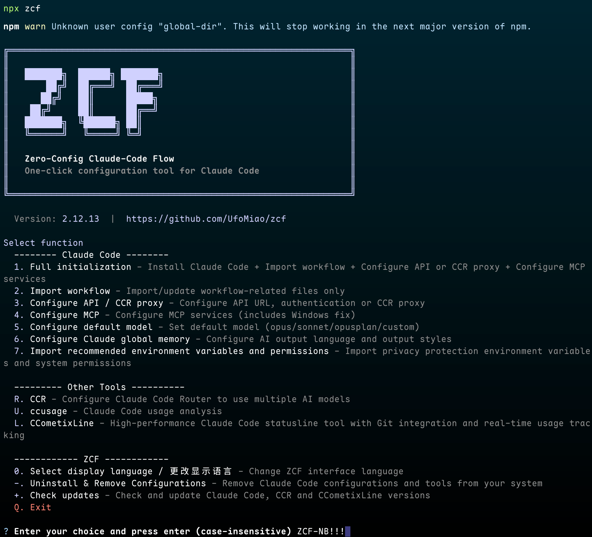

# ZCF - Zero-Config Claude-Code Flow

[](https://opensource.org/licenses/MIT)
[](https://claude.ai/code)
[](https://www.npmjs.com/package/zcf)
[](https://codecov.io/gh/UfoMiao/zcf)
[](https://deepwiki.com/UfoMiao/zcf)

[中文](README_zh-CN.md) | **English** | [Changelog](CHANGELOG.md)

> Zero-config, one-click setup for Claude Code with bilingual support, intelligent agent system and personalized AI assistant



## 🚀 Quick Start

### 🎯 Recommended: Use Interactive Menu (v2.0 New)

```bash
npx zcf          # Open interactive menu and choose operations based on your needs
```

Menu options include:

- `1` Full initialization (equivalent to `zcf i`)
- `2` Import workflows (equivalent to `zcf u`)
- `3-7` Configuration management (API/CCR, MCP, Model settings, AI personality, etc.)
- `R` Claude Code Router management (enhanced in v2.8.1)
- `U` ccusage - Claude Code usage analysis
- `+` Check updates - Check and update Claude Code and CCR versions
- More features...

### Or, use direct commands:

#### 🆕 First time using Claude Code

```bash
npx zcf i        # Execute full initialization directly: Install Claude Code + Import workflows + Configure API + Set up MCP services
# or
npx zcf → select 1  # Execute full initialization via menu
```

#### 🤖 Non-interactive Mode (New)

For CI/CD and automated setups, use `--skip-prompt` with configuration parameters:

```bash
# Complete non-interactive initialization
npx zcf i --skip-prompt \
  --lang en \
  --config-lang en \
  --ai-output-lang en \
  --install-claude yes \
  --config-action new \
  --api-type api_key \
  --api-key "sk-ant-..." \
  --mcp-services "context7,deepwiki" \
  --workflows "workflow,agents"

# Skip Claude Code installation and configure API only
npx zcf i --skip-prompt \
  --install-claude skip \
  --api-type auth_token \
  --auth-token "your-token"

# Use CCR proxy mode
npx zcf i --skip-prompt \
  --api-type ccr_proxy \
  --install-claude yes
```

#### 🔄 Already have Claude Code installed

```bash
npx zcf u        # Update workflows only: Quick add AI workflows and command system
# or
npx zcf → select 2  # Execute workflow update via menu
```

> **Note**:
>
> - Since v2.0, `zcf` opens the interactive menu by default, providing a visual operation interface
> - You can choose operations through the menu or use commands directly for quick execution
> - `zcf i` = full initialization, `zcf u` = update workflows only

#### 🎯 BMad Workflow (v2.7 New Feature)

[BMad](https://github.com/bmad-code-org/BMAD-METHOD) (BMad-Method: Universal AI Agent Framework) is an enterprise-grade workflow system that provides:

- Complete team of specialized AI agents (PO, PM, Architect, Dev, QA, etc.)
- Structured development process with quality gates
- Automatic documentation generation
- Support for both greenfield and brownfield projects

After installation, use `/bmad-init` to initialize the BMad workflow in your project.

#### 🚀 CCR (Claude Code Router) Support (v2.8+ Enhanced)

[CCR](https://github.com/musistudio/claude-code-router/blob/main/README.md) is a powerful proxy router that enables:

- **Free Model Access**: Use free AI models (like Gemini, DeepSeek) through Claude Code interface
- **Custom Routing**: Route different types of requests to different models based on your rules
- **Cost Optimization**: Significantly reduce API costs by using appropriate models for different tasks
- **Easy Management**: Interactive menu for CCR configuration and service control
- **Auto Updates**: Automatic version checking and updates for CCR and Claude Code (v2.8.1+)

To access CCR features:

```bash
npx zcf ccr      # Open CCR management menu
# or
npx zcf → select R
```

Check for updates (v2.8.1+):

```bash
npx zcf check-updates  # Check and update Claude Code and CCR to latest versions
# or
npx zcf → select +
```

CCR menu options:

- Initialize CCR - Install and configure CCR with preset providers
- Start UI - Launch CCR web interface for advanced configuration
- Service Control - Start/stop/restart CCR service
- Check Status - View current CCR service status

After CCR setup, ZCF automatically configures Claude Code to use CCR as the API proxy.

> **Important Note for v2.9.1 Users**: If you have previously used ZCF v2.9.1 to initialize CCR, please re-run the CCR initialization process to ensure the correct `@musistudio/claude-code-router` package is installed. Version 2.9.1 had an incorrect package name that has been fixed in later versions.

### Setup Process

Full initialization (`npx zcf`) will automatically:

- ✅ Detect and install Claude Code
- ✅ Select AI output language (new feature)
- ✅ Configure API keys or CCR proxy
- ✅ Select and configure MCP services
- ✅ Set up all necessary configuration files

### Usage

After configuration:

- **For first-time project use, strongly recommend running `/init` to generate CLAUDE.md for better AI understanding of project architecture**
- `<task description>` - Execute directly without workflow, following SOLID, KISS, DRY, and YAGNI principles, suitable for small tasks like bug fixes
- `/feat <task description>` - Start new feature development, divided into plan and UI phases
- `/workflow <task description>` - Execute complete development workflow, not automated, starts with multiple solution options, asks for user feedback at each step, allows plan modifications, maximum control

> **PS**:
>
> - Both feat and workflow have their advantages, try both to compare
> - Generated documents are located by default at `.claude/xxx.md` in project root, you can add `.claude/` to your project's `.gitignore`

## ✨ ZCF Tool Features

### 🌏 Multi-language Support

- Script interaction language: Controls installation prompts language
- Configuration file language: Determines which configuration set to install (zh-CN/en)
- AI output language: Choose the language for AI responses (supports Chinese, English, and custom languages)
- AI personality: Support multiple preset personalities (Professional, Catgirl, Friendly, Mentor) or custom

### 🔧 Smart Installation

- Auto-detects Claude Code installation status
- Uses npm for automatic installation (ensures compatibility)
- Cross-platform support (Windows/macOS/Linux/Termux)
- Automatic MCP service configuration
- Smart configuration merging and partial modification support (v2.0 new)
- Enhanced command detection mechanism (v2.1 new)
- Dangerous operation confirmation mechanism (v2.3 new)

### 📦 Complete Configuration

- CLAUDE.md system instructions
- settings.json configuration file
- commands custom commands
- agents AI agent configurations

### 🔐 API Configuration

- Supports two authentication methods:
  - **Auth Token**: For tokens obtained via OAuth or browser login
  - **API Key**: For API keys from Anthropic Console
- Custom API URL support
- Support for manual configuration later
- Partial modification: Update only needed configuration items (v2.0 new)

### 💾 Configuration Management

- Smart backup of existing configurations (all backups saved in ~/.claude/backup/)
- Configuration merge option (v2.0 enhanced: supports deep merge)
- Safe overwrite mechanism
- Automatic backup before MCP configuration changes
- Default model configuration (v2.0 new)
- AI memory management (v2.0 new)
- ZCF cache cleanup (v2.0 new)

## 📖 Usage Instructions

### Interactive Menu (v2.0)

```bash
$ npx zcf

 ZCF - Zero-Config Claude-Code Flow

? Select ZCF display language / 选择ZCF显示语言:
  ❯ 简体中文
    English

Select function:
  -------- Claude Code --------
  1. Full initialization - Install Claude Code + Import workflow + Configure API or CCR proxy + Configure MCP services
  2. Import workflow - Import/update workflow-related files only
  3. Configure API - Configure API URL and authentication (supports CCR proxy)
  4. Configure MCP - Configure MCP services (includes Windows fix)
  5. Configure default model - Set default model (opus/sonnet)
  6. Configure Claude global memory - Configure AI output language and personality
  7. Import recommended environment variables and permissions - Import privacy protection environment variables and system permissions

  --------- Other Tools ----------
  R. CCR Management - Claude Code Router management
  U. CCUsage - Claude Code usage analysis tool

  ------------ ZCF ------------
  0. Select display language / 更改显示语言 - Change ZCF interface language
  -. Clear preference cache - Clear preference language and other caches
  Q. Exit

Enter your choice: _
```

### Full Initialization Flow (Select 1 or use `zcf i`)

```bash
? Select Claude Code configuration language:
  ❯ 简体中文 (zh-CN) - Chinese (easier for Chinese users to customize)
    English (en) - English (recommended, lower token consumption)

? Select AI output language:
  AI will respond to you in this language
  ❯ 简体中文
    English
    Custom
    (Supports Japanese, French, German, and more)

? Select AI personality:
  ❯ Professional Assistant(Default)
    Catgirl Assistant
    Friendly Assistant
    Mentor Mode
    Custom

? Claude Code not found. Install automatically? (Y/n)

✔ Claude Code installed successfully

? Select API authentication method
  ❯ Use Auth Token (OAuth authentication)
    For tokens obtained via OAuth or browser login
    Use API Key (Key authentication)
    For API keys from Anthropic Console
    Configure CCR Proxy (Claude Code Router)
    Use free models and custom routing to reduce costs and explore the possibilities of Claude Code
    Skip (configure manually later)

? Enter API URL: https://api.anthropic.com
? Enter Auth Token or API Key: xxx

? Existing config detected. How to proceed?
  ❯ Backup and overwrite all
    Update workflow-related md files only with backup
    Merge config
    Skip

✔ All config files backed up to ~/.claude/backup/xxx
✔ Config files copied to ~/.claude

? Select workflows to install (space to select, enter to confirm)
  ❯ ◉ Six Steps Workflow (workflow) - Complete 6-phase development process
    ◉ Feature Planning and UX Design (feat + planner + ui-ux-designer) - Structured feature development
    ◉ Git Commands (commit + rollback + cleanBranches + worktree) - Streamlined Git operations
    ◉ BMAD-Method Extension Installer - Enterprise agile development workflow

✔ Installing workflows...
  ✔ Installed command: zcf/workflow.md
  ✔ Installed command: zcf/feat.md
  ✔ Installed agent: zcf/plan/planner.md
  ✔ Installed agent: zcf/plan/ui-ux-designer.md
  ✔ Installed command: zcf/git/git-commit.md
  ✔ Installed command: zcf/git/git-rollback.md
  ✔ Installed command: zcf/git/git-cleanBranches.md
  ✔ Installed command: zcf/git/git-worktree.md
  ✔ Installed command: zcf/bmad-init.md
✔ Workflow installation successful

✔ API configured

? Configure MCP services? (Y/n)

? Select MCP services to install (space to select, enter to confirm)
  ❯ ◯ Install all
    ◯ Context7 Documentation Query - Query latest library docs and code examples
    ◯ DeepWiki - Query GitHub repository docs and examples
    ◯ Playwright Browser Control - Direct browser automation control
    ◯ Exa AI Search - Web search using Exa AI

? Enter Exa API Key (get from https://dashboard.exa.ai/api-keys)

✔ MCP services configured

🎉 Setup complete! Use 'claude' command to start.
```

### Command Line Options

#### Commands Quick Reference

| Command      | Alias   | Description                                                                           |
| ------------ | ------- | ------------------------------------------------------------------------------------- |
| `zcf`        | -       | Show interactive menu (v2.0 default command)                                          |
| `zcf init`   | `zcf i` | Initialize Claude Code configuration                                                  |
| `zcf update` | `zcf u` | Update workflow-related md files with backup                                          |
| `zcf ccu`    | -       | Run Claude Code usage analysis tool - [ccusage](https://github.com/ryoppippi/ccusage) |
| `zcf ccr`    | -       | Open CCR (Claude Code Router) management menu                                         |

#### Common Options

```bash
# Specify configuration language
npx zcf --config-lang zh-CN
npx zcf -c zh-CN            # Using short option

# Force overwrite existing configuration
npx zcf --force
npx zcf -f                 # Using short option

# Update workflow-related md files with backup (preserve API and MCP configs)
npx zcf u                  # Using update command
npx zcf update             # Full command

# Show help information
npx zcf --help
npx zcf -h

# Show version
npx zcf --version
npx zcf -v
```

#### Usage Examples

```bash
# Show interactive menu (default)
npx zcf

# First-time installation, complete initialization
npx zcf i
npx zcf init              # Full command

# Update workflow-related md files with backup, keep API and MCP configs
npx zcf u
npx zcf update            # Full command

# Force reinitialize with Chinese config
npx zcf i --config-lang zh-CN --force
npx zcf i -c zh-CN -f      # Using short options

# Update to English prompts (lower token consumption)
npx zcf u --config-lang en
npx zcf u -c en            # Using short option

# Run Claude Code usage analysis tool (powered by ccusage)
npx zcf ccu               # Daily usage (default), or use: monthly, session, blocks
```

#### Non-interactive Mode Parameters

When using `--skip-prompt`, the following parameters are available:

| Parameter | Description | Values | Required |
|-----------|-------------|--------|----------|
| `--skip-prompt` | Skip all interactive prompts | - | Yes (for non-interactive mode) |
| `--lang, -l` | ZCF display language | `zh-CN`, `en` | No (default: `en`) |
| `--config-lang, -c` | Configuration language | `zh-CN`, `en` | No (default: `en`) |
| `--ai-output-lang, -a` | AI output language | `zh-CN`, `en`, custom | No (default: `en`) |
| `--install-claude` | Install Claude Code | `yes`, `no`, `skip` | No (default: `skip`) |
| `--config-action` | Config handling | `new`, `backup`, `merge`, `docs-only`, `skip` | No (default: `new`) |
| `--api-type` | API configuration type | `auth_token`, `api_key`, `ccr_proxy`, `skip` | No (default: `skip`) |
| `--api-key` | API key (for api_key type) | string | Required when `api-type=api_key` |
| `--auth-token` | Auth token (for auth_token type) | string | Required when `api-type=auth_token` |
| `--api-url` | Custom API URL | URL string | No (default: official API) |
| `--mcp-services` | MCP services to install | comma-separated list | No |
| `--mcp-api-keys` | API keys for MCP services | JSON string | No |
| `--workflows` | Workflows to install | comma-separated list | No |
| `--ai-personality` | AI personality type | `professional`, `catgirl`, `friendly`, `mentor`, custom | No |

## 📁 Project Structure

```
zcf/
├── README.md              # Documentation
├── package.json           # npm package configuration
├── bin/
│   └── zcf.mjs           # CLI entry point
├── src/                  # Source code
│   ├── cli.ts           # CLI main logic
│   ├── commands/        # Command implementations
│   ├── utils/           # Utility functions
│   └── constants.ts     # Constant definitions
├── templates/            # Configuration templates
│   ├── CLAUDE.md        # Project level config (v2.0 new)
│   ├── settings.json    # Base configuration (with privacy env vars)
│   ├── en/              # English version
│   │   ├── rules.md     # Core principles (formerly CLAUDE.md)
│   │   ├── personality.md # AI personality (v2.0 new)
│   │   ├── mcp.md       # MCP services guide (v2.0 new)
│   │   ├── agents/      # AI agents
│   │   └── commands/    # Command definitions
│   └── zh-CN/           # Chinese version
│       └── ... (same structure)
└── dist/                # Build output
```

## ✨ Core Features (v2.0 Enhanced)

### 🤖 Professional Agents

- **Task Planner**: Breaks down complex tasks into executable steps
- **UI/UX Designer**: Provides professional interface design guidance
- **AI Personality**: Support multiple preset personalities and custom (v2.0 new)
- **BMad Team** (New): Complete agile development team including:
  - Product Owner (PO): Requirements elicitation and prioritization
  - Project Manager (PM): Planning and coordination
  - System Architect: Technical design and architecture
  - Developer: Implementation and coding
  - QA Engineer: Testing and quality assurance
  - Scrum Master (SM): Process facilitation
  - Business Analyst: Requirements analysis
  - UX Expert: User experience design

### ⚡ Command System

- **Feature Development** (`/feat`): Structured new feature development
- **Workflow** (`/workflow`): Complete six-phase development workflow
- **Git Commands**: Streamlined Git operations
  - `/git-commit`: Smart commit with automatic staging and message generation
  - `/git-rollback`: Safely rollback to previous commits with backup
  - `/git-cleanBranches`: Clean up merged branches and maintain repository hygiene
  - `/git-worktree`: Manage Git worktrees with IDE integration and content migration
- **BMad Workflow** (`/bmad-init`): Initialize BMad workflow for enterprise development
  - Supports both greenfield (new projects) and brownfield (existing projects)
  - Provides comprehensive templates for PRDs, architecture docs, and user stories
  - Integrated quality gates and checklist system

### 🔧 Smart Configuration

- API key management (supports partial modification)
- Fine-grained permission control
- Multiple Claude model support (configurable default model)
- Interactive menu system (v2.0 new)
- AI memory management (v2.0 new)

## 🎯 Development Workflow

### Six-Phase Workflow

1. [Mode: Research] - Understand requirements
2. [Mode: Ideate] - Design solutions
3. [Mode: Plan] - Create detailed plan
4. [Mode: Execute] - Implement development
5. [Mode: Optimize] - Improve quality
6. [Mode: Review] - Final assessment

## 🛠️ Development

```bash
# Clone the project
git clone https://github.com/UfoMiao/zcf.git
cd zcf

# Install dependencies (using pnpm)
pnpm install

# Build project
pnpm build

# Local testing
node bin/zcf.mjs
```

## 💡 Best Practices

1. **Task Breakdown**: Keep tasks independent and testable
2. **Code Quality**: Follow SOLID, KISS, DRY, and YAGNI principles
3. **Documentation Management**: The plan will be stored in the `.claude/plan/` directory at the project root

## 🔧 Troubleshooting

If you encounter issues:

1. Re-run `npx zcf` to reconfigure
2. Check configuration files in `~/.claude/` directory
3. Ensure Claude Code is properly installed
4. If paths contain spaces, ZCF will automatically handle quote wrapping
5. Use ripgrep (`rg`) preferentially for file searching for better performance

### Cross-Platform Support

#### Windows Platform

ZCF fully supports Windows platform:

- **Auto-detection**: Automatically uses compatible `cmd /c npx` format on Windows systems
- **Config repair**: Existing incorrect configurations are automatically fixed during updates
- **Zero-config**: Windows users don't need any extra steps, same experience as macOS/Linux

If you encounter MCP connection issues on Windows, running `npx zcf` will automatically fix the configuration format.

#### Termux Support (v2.1 new)

ZCF now supports running in Android Termux environment:

- **Auto-adaptation**: Automatically detects Termux environment and uses compatible configuration
- **Enhanced detection**: Intelligently identifies available commands, ensuring normal operation in restricted environments
- **Full functionality**: Enjoy the same complete features in Termux as on desktop systems

### Security Features (v2.3 new)

#### Dangerous Operation Confirmation Mechanism

To protect user data security, the following operations require explicit confirmation:

- **File System**: Delete files/directories, bulk modifications, move system files
- **Code Commits**: `git commit`, `git push`, `git reset --hard`
- **System Config**: Modify environment variables, system settings, permissions
- **Data Operations**: Database deletions, schema changes, bulk updates
- **Network Requests**: Send sensitive data, call production APIs
- **Package Management**: Global install/uninstall, update core dependencies

## 🙏 Acknowledgments

This project is inspired by and incorporates the following open source projects:

- [LINUX DO - The New Ideal Community](https://linux.do)
- [CCR](https://github.com/musistudio/claude-code-router)
- [ccusage](https://github.com/ryoppippi/ccusage)
- [BMad Method](https://github.com/bmad-code-org/BMAD-METHOD)

Thanks to these community contributors for sharing!

## ❤️ Support & Sponsorship

If you find this project helpful, please consider sponsoring its development. Your support is greatly appreciated!

[](https://ko-fi.com/UfoMiao)

<table>
  <tr>
    <td></td>
    <td></td>
  </tr>
</table>

### Our Sponsors

A huge thank you to all our sponsors for their generous support!

- Tc (first sponsor)
- 16°C 咖啡 (My best friend🤪, offered Claude Code max $200 package)

## 📄 License

MIT License

---

If this project helps you, please give me a ⭐️ Star!

[](https://star-history.com/#UfoMiao/zcf&Date)
