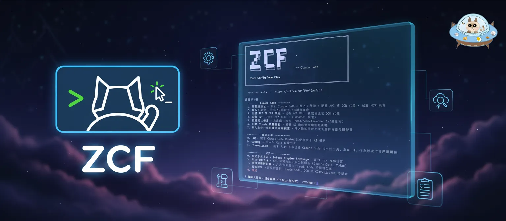

[![npm version][npm-version-src]][npm-version-href]
[![npm downloads][npm-downloads-src]][npm-downloads-href]
[![License][license-src]][license-href]
[![Claude Code][claude-code-src]][claude-code-href]
[![codecov][codecov-src]][codecov-href]
[![JSDocs][jsdocs-src]][jsdocs-href]
[![Ask DeepWiki][deepwiki-src]][deepwiki-href]

<div align="center">
  

  <h1>
    ZCF - Zero-Config Code Flow
  </h1>

  <p align="center">
    <a href="README.md">English</a> | <a href="README_zh-CN.md">简体中文</a> | <b>繁體中文</b> | <a href="README_ja-JP.md">日本語</a> | <a href="CHANGELOG.md">更新日誌</a>

**✨ 快速導航**: [Codex 支援](#-codex-支援v300-新增) | [BMad 工作流](#-bmad-工作流v27-新功能) | [Spec 工作流](#-spec-工作流v2124-新功能) | [開放網頁搜尋](#-開放網頁搜尋v2129-新功能) | [CCR 代理](#-ccr-claude-code-router-支援v28-增強版) | [CCometixLine](#-ccometixline-支援狀態列工具v299-新增) | [輸出風格](#-ai-輸出風格v212-新功能) | [多設定管理](#-多設定管理v320-新增)

> 零設定，一鍵搞定 Claude Code & Codex 環境設定 - 支援中英文雙語設定、智慧代理系統和個性化 AI 助手
  </p>
</div>

## ♥️ 贊助商 AI API

[](https://share.302.ai/gAT9VG)
[302.AI](https://share.302.ai/gAT9VG) 是一個按用量付費的企業級 AI 資源平台，提供市場上最新、最全面的 AI 模型和 API，以及多種開箱即用的線上 AI 應用。

## 🚀 快速開始

### 🎯 推薦：使用互動式選單（v2.0 新增）

```bash
npx zcf          # 開啟互動式選單，根據你的需求選擇操作
```

選單選項包括：

- `1` 完整初始化（等同於 `zcf i`）
- `2` 匯入工作流（等同於 `zcf u`）
- `3` 設定 API 或 CCR - API 設定或 CCR 代理設定
- `4` 設定 MCP - MCP 服務設定和管理
- `5` 設定預設模型 - 設定預設模型（opus/sonnet/sonnet 1m/自訂）
- `6` 設定 AI 記憶 - 設定 AI 輸出語言和全域輸出風格
- `7` 設定環境權限 - 匯入環境變數和權限設定
- `R` Claude Code Router 管理（v2.8.1 增強）
- `U` ccusage - Claude Code 用量分析
- `L` CCometixLine - 基於 Rust 的高效能狀態列工具，整合 Git 資訊和即時使用量追蹤（v2.9.9+ 新增）
- `+` 檢查更新 - 檢查並更新 Claude Code、CCR 和 CCometixLine 的版本（v2.9.9+ 增強）
- 更多功能選項...

#### 🎯 核心設定功能

**模型設定（選項 5）**：靈活設定您的預設 Claude 模型：
- **預設**：讓 Claude Code 為每個任務自動選擇最佳模型
- **Opus**：專門使用 Claude-4.1-Opus（高 token 消耗，請謹慎使用）
- **Sonnet 1M**：使用具有 1M 上下文視窗的 Sonnet 模型處理大上下文任務
- **自訂**：為主要任務和快速任務指定您自己的模型名稱（支援任何自訂模型）

**AI 記憶設定（選項 6）**：個性化您的 AI 助手：
- **AI 輸出語言**：設定 AI 回覆的語言（中文、英文或自訂）
- **全域輸出風格**：設定 AI 個性和回覆風格

### 或者，直接使用命令：

#### 🆕 首次使用 Claude Code

```bash
npx zcf i        # 直接執行完整初始化：安裝 Claude Code + 匯入工作流 + 設定 API 或 CCR 代理 + 設定 MCP 服務
# 或
npx zcf → 選擇 1  # 透過選單執行完整初始化
```

#### 🔄 已有 Claude Code 環境

```bash
npx zcf u        # 僅更新工作流：快速新增 AI 工作流和命令系統
# 或
npx zcf → 選擇 2  # 透過選單執行工作流更新
```

> **提示**：
>
> - v2.0 起，`zcf` 預設開啟互動式選單，提供視覺化操作介面
> - 你可以透過選單選擇操作，也可以直接使用命令快捷執行
> - `zcf i` = 完整初始化，`zcf u` = 僅更新工作流

#### 🌐 多語言支援

ZCF 支援雙語操作，所有命令自動進行語言切換：

```bash
# 使用中文進行所有操作
npx zcf --lang zh-CN          # 中文互動選單
npx zcf init --lang zh-CN      # 中文介面初始化
npx zcf ccr --all-lang zh-CN    # 中文設定 CCR

# 語言參數優先順序（由高到低）：
# --all-lang > --lang > 使用者儲存的偏好 > 互動提示
```

**語言參數說明：**
- `--lang, -l`：ZCF 介面語言（適用於所有命令）
- `--all-lang, -g`：一次性設定所有語言參數（最便捷）
- `--config-lang, -c`：範本檔案語言（僅 init/update 命令）
- `--ai-output-lang, -a`：AI 助手輸出語言（僅 init 命令）

#### 🤖 非互動模式

適用於 CI/CD 和自動化場景，使用 `--skip-prompt` 配合參數：

```bash
# 使用 API 提供商預設（v3.3.0+ 新增 - 簡化版）
npx zcf i -s -p 302ai -k "sk-xxx"

# 縮寫版（傳統方式）
npx zcf i -s -g zh-CN -t api_key -k "sk-xxx" -u "https://xxx.xxx"

# 完整版（傳統方式）
npx zcf i --skip-prompt --all-lang zh-CN --api-type api_key --api-key "sk-xxx" --api-url "https://xxx.xxx"

# 使用提供商預設設定自訂模型
npx zcf i -s -p 302ai -k "sk-xxx" -M "claude-sonnet-4-5" -F "claude-haiku-4-5"

# 完整版（設定自訂模型）
npx zcf i --skip-prompt \
  --api-type api_key \
  --api-key "sk-xxx" \
  --api-url "https://xxx.xxx" \
  --api-model "claude-sonnet-4-5" \
  --api-fast-model "claude-haiku-4-5"

# 多個 API 設定（JSON 字串）
npx zcf i -s --api-configs '[
  {"provider":"302ai","key":"sk-xxx"},
  {"provider":"glm","key":"sk-yyy"},
  {"name":"custom","type":"api_key","key":"sk-zzz","url":"https://custom.api.com","primaryModel":"claude-sonnet-4-5","fastModel":"claude-haiku-4-5","default":true}
]'

# 多個 API 設定（JSON 檔案）
npx zcf i -s --api-configs-file ./api-configs.json

# Codex 多提供商設定
npx zcf i -s -T cx --api-configs '[
  {"provider":"302ai","key":"sk-xxx"},
  {"name":"custom","type":"api_key","key":"sk-yyy","url":"https://custom.api.com","primaryModel":"gpt-5","default":true}
]'
```

#### 🎯 API 提供商預設（v3.3.0+ 新增）

ZCF 現在支援 API 提供商預設，可自動設定 baseUrl 和模型，將設定從 5+ 個參數簡化為僅需 2 個：

**支援的提供商：**
- `302ai` - [302.AI](https://share.302.ai/gAT9VG) API 服務
- `glm` - GLM（智譜 AI）
- `minimax` - MiniMax API 服務
- `kimi` - Kimi（月之暗面）
- `custom` - 自訂 API 端點（需要手動設定 URL）

**使用範例：**

```bash
# 使用 302.AI 提供商
npx zcf i --skip-prompt --provider 302ai --api-key "sk-xxx"
# 或使用縮寫
npx zcf i -s -p 302ai -k "sk-xxx"

# 使用 GLM 提供商
npx zcf i -s -p glm -k "sk-xxx"

# 使用 MiniMax 提供商
npx zcf i -s -p minimax -k "sk-xxx"

# 使用 Kimi 提供商
npx zcf i -s -p kimi -k "sk-xxx"

# 使用自訂提供商（需要 URL）
npx zcf i -s -p custom -k "sk-xxx" -u "https://api.example.com"

# 用於 Codex
npx zcf i -s -T cx -p 302ai -k "sk-xxx"
```

**優勢：**
- ✅ 自動設定 baseUrl
- ✅ 自動選擇 authType
- ✅ 自動設定模型（如果可用）
- ✅ 將設定從 5+ 個參數減少到 2 個
- ✅ 同時支援 Claude Code 和 Codex

#### 非互動模式參數說明

使用 `--skip-prompt` 時，可用的參數：

| 參數                         | 說明                                    | 可選值                                                                                                 | 是否必需                      | 預設值                                                                                 |
| ---------------------------- | --------------------------------------- | ------------------------------------------------------------------------------------------------------ | ----------------------------- | -------------------------------------------------------------------------------------- |
| `--skip-prompt, -s`          | 跳過所有互動提示                        | -                                                                                                      | 是（非互動模式必需）          | -                                                                                      |
| `--provider, -p`             | API 提供商預設（v3.3.0+ 新增）          | `302ai`, `glm`, `minimax`, `kimi`, `custom`                                                            | 否                            | -（透過自動填充 baseUrl 和模型簡化設定）                                              |
| `--lang, -l`                 | ZCF 顯示語言（適用於所有命令）           | `zh-CN`, `en`                                                                                          | 否                            | `en` 或使用者儲存的偏好                                                                 |
| `--config-lang, -c`          | 設定檔案語言（範本檔案語言）            | `zh-CN`, `en`                                                                                          | 否                            | `en`                                                                                   |
| `--ai-output-lang, -a`       | AI 輸出語言                             | `zh-CN`, `en`, 自訂字串                                                                            | 否                            | `en`                                                                                   |
| `--all-lang, -g`             | 統一設定所有語言參數（適用於所有命令）  | `zh-CN`, `en`, 自訂字串                                                                            | 否                            | -（優先順序：`--all-lang` > `--lang` > 使用者儲存的偏好 > 互動提示。若傳入自訂字串，則僅 AI 輸出語言使用該值，互動與設定語言保持 `en`） |
| `--config-action, -r`        | 設定處理方式                            | `new`, `backup`, `merge`, `docs-only`, `skip`                                                          | 否                            | `backup`                                                                               |
| `--api-type, -t`             | API 設定類型                            | `auth_token`, `api_key`, `ccr_proxy`, `skip`                                                           | 否                            | `skip`（指定 `--provider` 時自動設定為 `api_key`）                                    |
| `--api-key, -k`              | API 金鑰（用於 API 金鑰和認證權杖類型） | 字串                                                                                                 | `api-type` 不為 `skip` 時必需 | -                                                                                      |
| `--api-url, -u`              | 自訂 API URL                          | URL 字串                                                                                             | 否                            | 官方 API（使用 `--provider` 時自動填充）                                              |
| `--api-model, -M`            | 主 API 模型                             | 字串（如 `claude-sonnet-4-5`）                                                                   | 否                            | -（使用 `--provider` 時自動填充，如果可用）                                           |
| `--api-fast-model, -F`       | 快速 API 模型（僅 Claude Code）         | 字串（如 `claude-haiku-4-5`）                                                                        | 否                            | -（使用 `--provider` 時自動填充，如果可用）                                           |
| `--mcp-services, -m`         | 要安裝的 MCP 服務（多選，逗號分隔）     | `context7`, `open-websearch`, `spec-workflow`, `mcp-deepwiki`, `Playwright`, `exa`, `serena`, 或 `skip` 表示跳過全部 | 否                            | `all`                                                                                  |
| `--workflows, -w`            | 要安裝的工作流（多選，逗號分隔）        | `commonTools`, `sixStepsWorkflow`, `featPlanUx`, `gitWorkflow`, `bmadWorkflow`, 或 `skip` 表示跳過全部 | 否                            | `all`                                                                                  |
| `--output-styles, -o`        | 要安裝的輸出風格（多選，逗號分隔）      | `engineer-professional`, `nekomata-engineer`, `laowang-engineer`, `ojousama-engineer`，或 `skip` 表示不安裝                 | 否                            | `all`                                                                                  |
| `--default-output-style, -d` | 預設輸出風格                            | 同輸出風格選項，還包括內建風格：`default`, `explanatory`, `learning`                                   | 否                            | `engineer-professional`                                                                |
| `--install-cometix-line, -x` | 安裝 CCometixLine 狀態列工具            | `true`, `false`                                                                                        | 否                            | `true`                                                                                 |
| `--code-type, -T`            | 目標程式工具類型                        | `claude-code`, `codex`, `cc`, `cx`                                                                     | 否                            | ZCF 設定中的目前活躍工具類型                                                           |
| `--api-configs`              | 多個 API 設定（JSON 字串）            | API 設定物件的 JSON 陣列字串                                                                         | 否                            | -（與 `--api-configs-file` 互斥）                                                      |
| `--api-configs-file`         | 多個 API 設定（JSON 檔案路徑）          | 包含 API 設定陣列的 JSON 檔案路徑                                                                      | 否                            | -（與 `--api-configs` 互斥）                                                           |

#### 🤖 Codex 支援（v3.0.0+ 新增）

[Codex](https://www.npmjs.com/package/@openai/codex) 是 OpenAI 官方的程式碼生成 CLI 工具。ZCF 現在支援完整的 Codex 整合，具備與 Claude Code 相同的設定便利性。

**核心特性：**

- **統一工具管理**：透過 ZCF 選單在 Claude Code 和 Codex 之間無縫切換
- **智慧設定系統**：自動 Codex CLI 安裝、API 提供商設定和 MCP 服務整合
- **完善備份機制**：所有設定變更都包含時間戳記備份，支援復原功能
- **多提供商支援**：設定多個 API 提供商（OpenAI、自訂端點），支援輕鬆切換
- **系統提示整合**：安裝專業 AI 個性（工程師、貓娘工程師、老王工程師）
- **工作流範本**：匯入為程式碼生成任務最佳化的結構化開發工作流
- **進階解除安裝程式**：選擇性移除 Codex 元件，支援衝突解決

**Codex 快速入門：**

在 ZCF 主選單中切換到 Codex 模式：
```bash
npx zcf → 選擇 S  # 在 Claude Code 和 Codex 之間切換
```

或直接存取 Codex 功能：
```bash
# 完整 Codex 初始化
npx zcf → 選擇 1（切換到 Codex 模式後）

# 單獨 Codex 設定
npx zcf → 選擇 3  # 設定 Codex API 提供商
npx zcf → 選擇 4  # 設定 Codex MCP 服務
```

**設定選項：**

1. **API 提供商設定**：
   - **官方登入**：使用 OpenAI 官方認證系統
   - **自訂提供商**：設定多個 API 端點，支援提供商切換
   - **增量管理**：新增、編輯或刪除提供商，不影響現有設定

2. **系統提示風格**：
   - **專業工程師**：遵循 SOLID、KISS、DRY、YAGNI 原則的強健程式碼
   - **貓娘工程師**：可愛貓娘工程師，具備嚴格的技術標準
   - **老王工程師**：暴脾氣技術流，絕不容忍低品質程式碼

3. **工作流整合**：
   - **六步工作流**：從研究到最佳化的結構化開發流程
   - **自訂工作流**：匯入和設定任務特定的開發範本

4. **MCP 服務**：與現有 MCP 服務完全相容，包括：
   - Context7、開放網頁搜尋、Spec 工作流
   - DeepWiki、Playwright、EXA 搜尋
   - Serena 助手用於語義程式碼檢索與編輯
   - 自動服務設定與 API 金鑰管理

**檔案位置：**

- 設定檔案：`~/.codex/config.toml`
- 認證檔案：`~/.codex/auth.json`
- 系統提示：`~/.codex/AGENTS.md`
- 工作流：`~/.codex/prompts/`
- 備份：`~/.codex/backup/`

**工具間遷移：**

ZCF 允許在 Claude Code 和 Codex 之間無縫切換，同時保留您的偏好設定和工作流設定。兩個工具共享相同的 MCP 服務和工作流範本，確保一致的開發體驗。

#### 🎨 AI 輸出風格（v2.12+ 新功能）

ZCF 現在支援可自訂的 AI 輸出風格，個性化你的 Claude Code 體驗：

<p align="center">
<a href="https://github.com/Haleclipse">

</a>
</p>
<p align="center">傲嬌的<a href="https://github.com/Haleclipse">哈雷醬</a>大小姐(￣▽￣)ゞ</p>


**可用的輸出風格：**

- `engineer-professional`：專業軟體工程師，遵循 SOLID、KISS、DRY、YAGNI 原則
- `nekomata-engineer`：專業貓娘工程師 幽浮喵，結合嚴謹工程技術與可愛貓娘特質
- `laowang-engineer`：老王暴脾氣技術流，絕不容忍程式碼錯誤和不規範程式碼
- `ojousama-engineer`：傲嬌藍髮雙馬尾大小姐程式設計師哈雷醬，融合嚴謹工程師素養與傲嬌大小姐特質
- 內建樣式：`default`、`explanatory`、`learning`（始終可用）

**功能特性：**

- 安裝多個樣式並在它們之間切換
- 為所有專案設定全域預設樣式
- 自動清理舊版個性化設定檔案
- 基於範本的自訂系統

**使用提示：**

- 可使用 `/output-style` 命令隨時切換專案級的輸出風格
- 或在 ZCF 選單第 6 項中修改全域輸出風格

**重要提示：**

- Claude Code 版本需要大於 1.0.81 才支援 output-style，可使用 `npx zcf check` 進行更新。
- 舊版的全域記憶規則已遷移到 `專業軟體工程師` 輸出風格中，解決了佔用過多 token 以及 AI 容易忘記全域記憶的問題。

#### 🎯 BMad 工作流（v2.7 新功能）

[BMad](https://github.com/bmad-code-org/BMAD-METHOD)（BMad-Method: Universal AI Agent Framework）是企業級的工作流系統，提供：

- 完整的專業 AI 代理團隊（PO、PM、架構師、開發、QA 等）
- 結構化的開發流程與品質關卡
- 自動化文件產生
- 支援全新專案（greenfield）和現有專案（brownfield）

安裝後，使用 `/bmad-init` 在專案中初始化 BMad 工作流。

#### 📋 Spec 工作流（v2.12.4+ 新功能）

[Spec 工作流](https://github.com/Pimzino/spec-workflow-mcp) 是一個綜合性的 MCP 服務，提供從需求到實作的結構化特性開發工作流程：

- **需求分析**：結構化需求收集和文件編寫
- **設計階段**：詳細的技術設計和架構規劃
- **任務管理**：自動任務拆解和進度追蹤
- **實施工作流**：從需求到實作的系統化方法
- **互動式儀表板**：內建的工作流視覺化和管理儀表板
- **審批系統**：每個開發階段的評審和審批流程

Spec 工作流 MCP 提供可選的工作流視覺化儀表板。使用者可以手動啟動儀表板：
```bash
npx -y @pimzino/spec-workflow-mcp@latest --dashboard
```

或者安裝 [VS Code 擴充套件](https://marketplace.visualstudio.com/items?itemName=Pimzino.spec-workflow-mcp) 以獲得整合的工作流管理功能。

**使用指南**：詳細使用說明和最佳實踐，請參閱 [Spec 工作流官方文件](https://github.com/Pimzino/spec-workflow-mcp/blob/main/README.md#quick-start)。

#### 🔍 開放網頁搜尋（v2.12.9+ 新功能）

[開放網頁搜尋](https://github.com/Aas-ee/open-webSearch) 是一個多功能的網頁搜尋 MCP 服務，提供多種搜尋引擎存取：

- **多引擎支援**：支援 DuckDuckGo、Bing 和 Brave 搜尋引擎
- **隱私保護**：預設使用注重隱私的搜尋引擎
- **靈活設定**：可自訂搜尋引擎偏好設定
- **無需 API 金鑰**：開箱即用，無需額外認證
- **搜尋聚合**：支援合併多個引擎的搜尋結果

#### 🚀 CCR (Claude Code Router) 支援（v2.8+ 增強版）

[CCR](https://github.com/musistudio/claude-code-router/blob/main/README_zh.md) 是一個強大的代理路由器，可以實現：

- **免費模型接入**：透過 Claude Code 介面使用免費 AI 模型（如 Gemini、DeepSeek）
- **自訂路由**：根據規則將不同類型的請求路由到不同的模型
- **成本最佳化**：透過為不同任務使用合適的模型，顯著降低 API 成本
- **便捷管理**：提供互動式選單進行 CCR 設定和服務控制
- **自動更新**：CCR 和 Claude Code 的自動版本檢查和更新（v2.8.1+）

存取 CCR 功能：

```bash
npx zcf ccr      # 開啟 CCR 管理選單
# 或
npx zcf → 選擇 R
```

CCR 選單選項：

- 初始化 CCR - 安裝並設定 CCR，支援預設提供商
- 啟動 UI - 啟動 CCR Web 介面進行進階設定
- 服務控制 - 啟動/停止/重新啟動 CCR 服務
- 檢查狀態 - 檢視目前 CCR 服務狀態

CCR 設定完成後，ZCF 會自動設定 Claude Code 使用 CCR 作為 API 代理。

> **v2.9.1 版本使用者重要提示**：如果您之前使用過 ZCF v2.9.1 版本初始化 CCR，請重新執行 CCR 初始化流程，以確保安裝正確的 `@musistudio/claude-code-router` 套件。v2.9.1 版本中存在套件名稱錯誤問題，該問題已在後續版本中修復。


#### 📊 CCometixLine 支援（狀態列工具）（v2.9.9+ 新增）

[CCometixLine](https://github.com/Haleclipse/CCometixLine) 是一個基於 Rust 的高效能狀態列工具，提供：

- **即時用量追蹤**：即時監控 Claude Code API 使用情況
- **Git 整合**：顯示 Git 狀態和分支資訊
- **狀態列顯示**：與終端狀態列原生整合
- **效能最佳化**：使用 Rust 建置，資源消耗極低
- **TUI 設定介面**：互動式終端介面，可自訂主題、分段顯示和顯示選項
- **自動更新**：已整合到 ZCF 的更新檢查系統

CCometixLine 選單選項（透過 `npx zcf` → `L` 存取）：

- `1` 安裝或更新 - 使用 npm 安裝或更新 CCometixLine
- `2` 列印預設設定 - 顯示目前 CCometixLine 設定
- `3` 自訂設定 - TUI 設定模式 - 互動式終端介面，用於自訂設定

> **v2.9.9 版本使用者重要提示**：如果您之前使用過 ZCF v2.9.9 版本安裝 CCometixLine，請重新執行一次安裝流程，以確保 CCometixLine 設定被正確新增。執行 `npx zcf`->`選擇 L`->`選擇 1`，新增 CCometixLine 設定。

#### 🚀 檢查更新（v2.8.1+，CCometixLine 支援 v2.9.9+）：

```bash
npx zcf check-updates  # 檢查並更新 Claude Code、CCR 和 CCometixLine 到最新版本
# 或
npx zcf → 選擇 +
```

### 初始化流程

完整初始化（`npx zcf`）會自動：

- ✅ 偵測並安裝 Claude Code
- ✅ 選擇 AI 輸出語言（新增）
- ✅ 設定 API 金鑰或 CCR 代理
- ✅ 選擇並設定 MCP 服務
- ✅ 設定所有必要的設定檔案

### 使用方式

設定完成後：

- **專案第一次使用強烈建議先執行 `/init-project` 進行層級初始化，產生 CLAUDE.md 便於 AI 理解專案架構**
- `<任務描述>` - 不使用任何工作流直接執行，會遵循 SOLID、KISS、DRY 和 YAGNI 原則，適合修復 Bug 等小任務
- `/feat <任務描述>` - 開始新功能開發，分為 plan 和 ui 兩個階段
- `/workflow <任務描述>` - 執行完整開發工作流，不是自動化，開始會給出多套方案，每一步會詢問使用者意見，可隨時修改方案，掌控力 MAX

> **PS**:
>
> - feat 和 workflow 這兩套各有優勢，可以都試試比較一下
> - 產生的文件位置預設都是專案根目錄下的 `.claude/xxx.md`，可以把 `.claude/` 加入專案的 `.gitignore` 裡

## ✨ ZCF 工具特性

### 🌏 多語言支援

- 腳本互動語言：控制安裝過程的提示語言
- 設定檔案語言：決定安裝哪套設定檔案（zh-CN/en）
- AI 輸出語言：選擇 AI 回覆使用的語言（支援簡體中文、English 及自訂語言）
- AI 輸出風格：支援多種預設風格（專業工程師、貓娘工程師、老王工程師）個性化體驗

### 🔧 智慧安裝

- 自動偵測 Claude Code 安裝狀態
- 使用 npm 進行自動安裝（確保相容性）
- 跨平台支援（Windows/macOS/Linux/WSL/Termux）
- 自動設定 MCP 服務
- 智慧設定合併和部分修改支援（v2.0 新增）
- 增強的命令偵測機制（v2.1 新增）
- 危險操作確認機制（v2.3 新增）

### 📦 完整設定

- CLAUDE.md 系統指令
- settings.json 設定檔案
- commands 自訂命令
- agents AI 代理設定

### 🔐 API 設定

ZCF 為 Claude Code 和 Codex 提供靈活的 API 設定選項：

**API 供應商預設快速設定（v3.3.0+ 新增）：**

從熱門 API 供應商中選擇預設定設定：
- **302.AI** - 按需付費的 AI 服務，支援全面的模型
- **GLM（智譜 AI）** - 智譜 AI 的 GLM 模型
- **MiniMax** - MiniMax AI 服務
- **Kimi（Moonshot AI）** - Moonshot 的 Kimi 模型
- **自訂設定** - 適用於任何供應商的完整手動設定

使用預設供應商時，您只需：
1. 從清單中選擇供應商
2. 輸入您的 API 金鑰

系統會自動設定：
- API 基礎 URL
- 認證類型（API Key 或 Auth Token）
- 預設模型（如適用）
- Wire API 協定（用於 Codex）

**傳統設定方式：**

- **官方登入**：使用官方認證系統（無需 API 設定）
- **Auth Token**：適用於透過 OAuth 或瀏覽器登入取得的權杖
- **API Key**：適用於從 Anthropic Console 或自訂供應商取得的 API 金鑰
- **CCR 代理**：設定 Claude Code Router 代理
- **自訂 API URL**：支援任何相容的 API 端點
- **部分修改**：僅更新需要的設定項（v2.0+）

### 💾 設定管理

- 智慧備份現有設定（所有備份儲存在 ~/.claude/backup/）
- 設定合併選項（v2.0 增強：支援深度合併）
- 安全的覆寫機制
- MCP 設定修改前自動備份
- 預設模型設定（v2.0 新增）
- AI 記憶管理（v2.0 新增）
- ZCF 快取清理（v2.0 新增）

### 🧩 多設定管理（v3.2.0 新增）

統一的增量式、互動式多設定管理，涵蓋 Claude Code 與 Codex：

- Claude Code：管理 API 設定（新增/編輯/刪除、預設設定、重複偵測）
- Codex：管理模型提供商（列出/切換，官方登入透過互動式選擇）
- 安全備份；防止誤刪最後一個設定（Claude Code）
- 應用時寫入 `~/.claude/settings.json`，必要時自動重新啟動 CCR
- 設定儲存：`~/.ufomiao/zcf/config.toml`（備份 `config.backup.YYYY-MM-DD_HH-mm-ss.toml`）

指定工具類型：

```bash
# -T 支援：claude-code|codex 或短別名 cc|cx
npx zcf cs --list -T cc    # 列出 Claude Code 設定
npx zcf cs --list -T cx    # 列出 Codex 提供商
npx zcf cs -l -T cc        # 使用縮寫（等價於 --list）
npx zcf cs -l -T cx        # 使用縮寫（等價於 --list）
```

Claude Code 用法：

```bash
# 快速切換
npx zcf cs official -T cc  # 切換到官方登入
npx zcf cs ccr -T cc       # 切換到 CCR 代理
npx zcf cs my-profile -T cc
```

Codex 用法：

```bash
# 列出並切換提供商
npx zcf cs --list -T cx
npx zcf cs my-provider -T cx

# 切換到官方登入（互動式選擇）
npx zcf config-switch -T cx
```

說明：
- 環境變數對應（Claude Code）：API Key → `ANTHROPIC_API_KEY`，Auth Token → `ANTHROPIC_AUTH_TOKEN`，Base URL → `ANTHROPIC_BASE_URL`。
- 目前工具類型會記錄在 ZCF 設定中；只有當你要操作的不是目前工具時，才需要加 `-T cc/cx`。

## 📖 使用說明

### 互動式選單（v2.0）

```bash
$ npx zcf

 ZCF - Zero-Config Code Flow

? Select ZCF display language / 選擇 ZCF 顯示語言:
  ❯ 簡體中文
    English

請選擇功能:
  -------- Claude Code --------
  1. 完整初始化 - 安裝 Claude Code + 匯入工作流 + 設定 API 或 CCR 代理 + 設定 MCP 服務
  2. 匯入工作流 - 僅匯入/更新工作流相關檔案
  3. 設定 API - 設定 API URL 和認證資訊（支援 CCR 代理）
  4. 設定 MCP - 設定 MCP 服務（含 Windows 修復）
  5. 設定預設模型 - 設定預設模型（opus/sonnet/sonnet 1m/自訂）
  6. 設定 Claude 全域記憶 - 設定 AI 輸出語言和輸出風格
  7. 匯入推薦環境變數和權限設定 - 匯入隱私保護環境變數和系統權限設定

  --------- 其他工具 ----------
  R. CCR - Claude Code Router 管理
  U. ccusage - Claude Code 用量分析
  L. CCometixLine - 基於 Rust 的高效能狀態列工具，整合 Git 資訊和即時使用量追蹤

  ------------ ZCF ------------
  0. 更改顯示語言 / Select display language - 更改 ZCF 介面語言
  -. 解除安裝 - 從系統中刪除 Claude Code 設定和工具
  +. 檢查更新 - 檢查並更新 Claude Code、CCR 和 CCometixLine 的版本
  Q. 退出

請輸入選項，Enter 確認（不區分大小寫）: _
```

### 完整初始化流程（選擇 1 或使用 `zcf i`）

```bash
? 選擇設定語言:
  ❯ English (en) - 英文版（token 消耗更低）
    簡體中文 (zh-CN) - 中文版（便於中文使用者自訂）
    日本語 (ja) - 日本語版（日本語ユーザー向けカスタマイズ）

? 選擇 AI 輸出語言:
  AI 將使用此語言回覆你的問題
  ❯ 簡體中文
    English
    日本語
    Custom
    （支援法語、德語等多種語言）

? 偵測到 Claude Code 未安裝，是否自動安裝？(Y/n)

✔ Claude Code 安裝成功

? 偵測到已有設定檔案，如何處理？
  ❯ 備份並覆寫 - 將現有設定備份到 ~/.claude/backup/
    僅更新文件 - 只更新工作流和文件，保留現有 API 設定
    合併設定 - 與現有設定合併，保留使用者自訂內容
    跳過 - 跳過設定更新

? 選擇 API 認證方式
  ❯ 使用官方登入
    使用官方認證系統，無需設定 API
    使用 Auth Token (OAuth 認證)
    適用於透過 OAuth 或瀏覽器登入取得的權杖
    使用 API Key (金鑰認證)
    適用於從 Anthropic Console 取得的 API 金鑰
    設定 CCR 代理（Claude Code Router）
    透過代理路由使用多種 AI 模型，降低成本並探索更多可能性
    跳過（稍後手動設定）

? 請輸入 API URL: https://api.anthropic.com
? 請輸入 Auth Token 或 API Key: xxx

✔ API 設定完成

? 選擇要安裝的輸出風格:
  ❯ 工程師專業版 - 專業的軟體工程師，嚴格遵循 SOLID、KISS、DRY、YAGNI 原則
    貓娘工程師 - 專業的貓娘工程師幽浮喵，結合嚴謹工程師素養與可愛貓娘特質
    老王暴躁技術流 - 老王暴躁技術流，絕不容忍程式碼報錯和不規範的程式碼
    大小姐工程師 - 傲嬌金髮大小姐程式設計師哈雷醬，融合嚴謹工程師素養與傲嬌大小姐特質

? 選擇全域預設輸出風格:
  ❯ 工程師專業版

? 選擇要安裝的工作流（空格選擇，Enter 確認）
❯ ◉ 通用工具 (init-project + init-architect + get-current-datetime) - 基礎專案初始化和實用命令
◉ 六步工作流 (workflow) - 完整的六階段開發流程
◉ 功能規劃和 UX 設計 (feat + planner + ui-ux-designer) - 結構化新功能開發
◉ Git 指令 (commit + rollback + cleanBranches + worktree) - 簡化的 Git 操作
◉ BMAD-Method 擴充安裝器 - 企業級敏捷開發工作流

✔ 正在安裝工作流...
✔ 已安裝命令: zcf/workflow.md
✔ 已安裝命令: zcf/feat.md
✔ 已安裝代理: zcf/plan/planner.md
✔ 已安裝代理: zcf/plan/ui-ux-designer.md
✔ 已安裝命令: zcf/git/git-commit.md
✔ 已安裝命令: zcf/git/git-rollback.md
✔ 已安裝命令: zcf/git/git-cleanBranches.md
✔ 已安裝命令: zcf/git/git-worktree.md
✔ 已安裝命令: zcf/bmad-init.md
✔ 工作流安裝成功

? 是否設定 MCP 服務？(Y/n)

? 選擇要安裝的 MCP 服務（空格選擇，Enter 確認）
❯ ◯ 全部安裝
◯ Context7 文件查詢 - 查詢最新的函式庫文件和程式碼範例
◯ open-websearch - 使用 DuckDuckGo、Bing 和 Brave 搜尋引擎進行網頁搜尋
◯ Spec 工作流 - 規範化特性開發工作流程，從需求到實作的系統化方法
◯ DeepWiki - 查詢 GitHub 儲存庫文件和範例
◯ Playwright 瀏覽器控制 - 直接控制瀏覽器進行自動化操作
◯ Exa AI 搜尋 - 使用 Exa AI 進行網頁搜尋
◯ Serena 助手 - 提供類似 IDE 的語義程式碼檢索與編輯

? 請輸入 Exa API Key（可從 https://dashboard.exa.ai/api-keys 取得）

✔ MCP 服務已設定

? 是否安裝 CCometixLine 狀態列工具？(Y/n)

✔ 設定完成！Claude Code 環境已就緒

🎉 設定完成！使用 'claude' 命令開始體驗。

```

### 命令列參數

#### 命令速查表

| 命令                | 縮寫    | 說明                                                                            |
| ------------------- | ------- | ------------------------------------------------------------------------------- |
| `zcf`               | -       | 顯示互動式選單（v2.0 預設命令）                                                 |
| `zcf init`          | `zcf i` | 初始化 Claude Code 設定                                                         |
| `zcf update`        | `zcf u` | 更新 Prompt 文件並備份舊設定                                                    |
| `zcf ccu`           | -       | 執行 Claude Code 用量分析工具 - [ccusage](https://github.com/ryoppippi/ccusage) |
| `zcf ccr`           | -       | 開啟 CCR (Claude Code Router) 管理選單                                          |
| `zcf config-switch` | `zcf cs` | API 提供商/設定切換（支援 Claude Code 與 Codex，使用 `-T cc` / `-T cx`） |
| `zcf uninstall`     | -       | 互動式 Claude Code 設定和工具解除安裝程式                                            |
| `zcf check-updates` | -       | 檢查並更新 Claude Code、CCR 和 CCometixLine 的版本                              |

#### 常用選項

```bash
# 指定設定語言
npx zcf --config-lang zh-CN
npx zcf -c zh-CN            # 使用縮寫

# 強制覆寫現有設定
npx zcf --force
npx zcf -f                 # 使用縮寫

# 更新 Prompt 文件並備份舊設定（保留 API 和 MCP 設定）
npx zcf u                  # 使用 update 命令
npx zcf update             # 完整命令

# 檢視說明資訊
npx zcf --help
npx zcf -h

# 檢視版本
npx zcf --version
npx zcf -v
```

#### 使用範例

```bash
# 顯示互動式選單（預設）
npx zcf

# 首次安裝，完整初始化
npx zcf i
npx zcf init              # 完整命令

# 更新 Prompt 文件並備份舊設定，保留 API 和 MCP 設定
npx zcf u
npx zcf update            # 完整命令

# 強制使用中文設定重新初始化
npx zcf i --config-lang zh-CN --force
npx zcf i -c zh-CN -f      # 使用縮寫

# 更新到英文版 Prompt（降低 token 消耗）
npx zcf u --config-lang en
npx zcf u -c en            # 使用縮寫

# 執行 Claude Code 用量分析工具（由 ccusage 提供支援）
npx zcf ccu               # 每日用量（預設），或使用: monthly, session, blocks

# Codex API 提供商切換（v3.0.0+ 新增）
npx zcf config-switch     # 互動式選擇提供商
npx zcf cs                # 使用縮寫
npx zcf cs provider-name  # 直接切換到指定提供商
npx zcf cs --list         # 列出所有可用的提供商
npx zcf cs -l             # 使用縮寫（等價於 --list）
```

## 📁 專案結構

```
zcf/
├── README.md              # 說明文件
├── package.json           # npm 套件設定
├── bin/
│   └── zcf.mjs           # CLI 入口
├── src/                  # 原始碼
│   ├── cli.ts           # CLI 主邏輯
│   ├── commands/        # 命令實作
│   ├── utils/           # 工具函式
│   └── constants.ts     # 常數定義
├── templates/            # 設定範本
│   ├── CLAUDE.md        # 專案級設定（v2.0 新增）
│   ├── settings.json    # 基礎設定（含隱私保護環境變數）
│   ├── en/              # 英文版
│   │   ├── rules.md     # 核心原則（原 CLAUDE.md）
│   │   ├── output-styles/ # AI 輸出風格（v2.12+ 新增）
│   │   ├── mcp.md       # MCP 服務說明（v2.0 新增）
│   │   ├── agents/      # AI 代理
│   │   └── commands/    # 命令定義
│   └── zh-CN/           # 中文版
│       └── ... (相同結構)
└── dist/                # 建置輸出
```

## ✨ 核心特性（v2.0 增強）

### 🤖 專業代理

- **任務規劃師**：將複雜任務拆解為可執行步驟
- **UI/UX 設計師**：提供專業介面設計指導
- **AI 輸出風格**：支援多種預設風格個性化體驗（v2.12+ 新增）
- **BMad 團隊**（新增）：完整的敏捷開發團隊，包括：
  - 產品負責人（PO）：需求挖掘和優先順序排序
  - 專案經理（PM）：計畫和協調
  - 系統架構師：技術設計和架構
  - 開發工程師：實施和編碼
  - QA 工程師：測試和品質保證
  - Scrum Master（SM）：流程促進
  - 業務分析師：需求分析
  - UX 專家：使用者體驗設計

### ⚡ 命令系統

- **功能開發** (`/feat`)：結構化新功能開發
- **工作流** (`/workflow`)：完整的六階段開發流程
- **Git 指令**：簡化的 Git 操作
  - `/git-commit`：智慧提交，自動暫存和產生提交訊息
  - `/git-rollback`：安全回復到之前的提交，帶備份功能
  - `/git-cleanBranches`：清理已合併的分支，保持儲存庫整潔
  - `/git-worktree`：管理 Git 工作樹，支援 IDE 整合和內容遷移
- **BMad 工作流** (`/bmad-init`)：初始化企業級開發的 BMad 工作流
  - 支援全新專案（greenfield）和現有專案（brownfield）
  - 提供 PRD、架構文件、使用者故事的完整範本
  - 整合品質關卡和檢查清單系統

### 🔧 智慧設定

- API 金鑰管理（支援部分修改）
- 細粒度權限控制
- 多種 Claude 模型支援（可設定預設模型）
- 互動式選單系統（v2.0 新增）
- AI 記憶管理（v2.0 新增）

## 🎯 開發工作流

### 六階段工作流

1. [模式：研究] - 理解需求
2. [模式：構思] - 設計方案
3. [模式：計畫] - 制定詳細計畫
4. [模式：執行] - 實施開發
5. [模式：最佳化] - 提升品質
6. [模式：評審] - 最終評估

## 🛠️ 開發

```bash
# 複製專案
git clone https://github.com/UfoMiao/zcf.git
cd zcf

# 安裝相依套件（使用 pnpm）
pnpm install

# 建置專案
pnpm build

# 本機測試
node bin/zcf.mjs
```

## 💡 最佳實踐

1. **任務分解**：保持任務獨立可測試
2. **程式碼品質**：遵循 SOLID、KISS、DRY 和 YAGNI 原則
3. **文件管理**：計畫儲存在專案根目錄的 `.claude/plan/` 目錄下

## 🔧 故障排除

如果遇到問題，可以：

1. 重新執行 `npx zcf` 重新設定
2. 檢查 `~/.claude/` 目錄下的設定檔案
3. 確保 Claude Code 已正確安裝
4. 如果路徑包含空格，ZCF 會自動處理引號包裹
5. 優先使用 ripgrep (`rg`) 進行檔案搜尋以獲得更好效能

### 跨平台支援

#### Windows 平台

ZCF 已完全支援 Windows 平台：

- **自動偵測**：在 Windows 系統上會自動使用相容的 `cmd /c npx` 格式
- **設定修復**：現有的錯誤設定會在更新時自動修復
- **零設定**：Windows 使用者無需任何額外操作，與 macOS/Linux 體驗一致

如果在 Windows 上遇到 MCP 連線問題，執行 `npx zcf` 會自動修復設定格式。

#### WSL 支援（v2.12.12+ 新增）

ZCF 現已全面支援 Windows 子系統 Linux (WSL)：

- **智慧偵測**：透過環境變數、系統檔案和掛載點進行多層次 WSL 環境偵測
- **發行版識別**：自動識別 WSL 發行版（Ubuntu、Debian 等）以最佳化設定
- **無縫安裝**：在 WSL 環境中提供原生 Linux 風格的安裝體驗
- **路徑管理**：智慧處理 WSL 特有的設定路徑和檔案位置

在 WSL 環境中執行時，ZCF 會自動偵測環境並顯示對應的安裝提示。

#### Termux 支援（v2.1 新增）

ZCF 現已支援在 Android Termux 環境中執行：

- **自動適配**：自動偵測 Termux 環境並使用相容設定
- **增強偵測**：智慧識別可用命令，確保在受限環境中正常工作
- **完整功能**：在 Termux 中享受與桌面系統相同的完整功能

### 安全特性（v2.3 新增）

#### 危險操作確認機制

為保護使用者資料安全，以下操作需要明確確認：

- **檔案系統**：刪除檔案/目錄、批次修改、移動系統檔案
- **程式碼提交**：`git commit`、`git push`、`git reset --hard`
- **系統設定**：修改環境變數、系統設定、權限變更
- **資料操作**：資料庫刪除、結構描述更改、批次更新
- **網路請求**：傳送敏感資料、呼叫生產環境 API
- **套件管理**：全域安裝/解除安裝、更新核心相依套件

## 🙏 鳴謝

本專案的靈感來源和引入的開源專案：

- [LINUX DO - 新的理想型社群](https://linux.do)
- [CCR](https://github.com/musistudio/claude-code-router)
- [CCometixLine](https://github.com/Haleclipse/CCometixLine)
- [ccusage](https://github.com/ryoppippi/ccusage)
- [BMad Method](https://github.com/bmad-code-org/BMAD-METHOD)

  感謝這些社群貢獻者的分享！

## ❤️ 支援與贊助

如果您覺得這個專案有幫助，請考慮贊助它的開發。非常感謝您的支援！

[](https://ko-fi.com/UfoMiao)

<table>
  <tr>
    <td></td>
    <td></td>
  </tr>
</table>

### 我們的贊助商

非常感謝所有贊助商的慷慨支援！

- [302.AI](https://share.302.ai/gAT9VG) （第一個企業贊助商 🤠）
- Tc (第一個贊助者)
- Argolinhas (第一個 ko-fi 贊助者 ٩(•̤̀ᵕ•̤́๑))
- r\*r (第一個不願透露姓名的贊助者 🤣)
- \*\*康 (第一個 KFC 贊助者 🍗)
- \*東 (第一個咖啡贊助者 ☕️)
- 煉\*3 (第一個 termux 使用者贊助者 📱)
- [chamo101](https://github.com/chamo101) (第一個 GitHub issue 贊助者 🎉)
- 初嶼賢 (第一個 codex 使用者贊助者 🙅🏻‍♂️)
- Protein （第一個一路發發贊助者 😏）
- [musistudio](https://github.com/musistudio) (第一個開源專案作者贊助者，[CCR](https://github.com/musistudio/claude-code-router) 的作者哦 🤩)
- [BeatSeat](https://github.com/BeatSeat) (社群大佬 😎，提供了 $1000 Claude 額度)
- [wenwen](https://github.com/wenwen12345) (社群大佬 🤓，提供了每日 $100 Claude&GPT 額度)
- 16°C 咖啡 (我的好基友 🤪, 提供了 ChatGPT Pro $200 套餐)

### 推廣感謝

感謝以下推廣本專案的作者：

- 逛逛 GitHub，推文：https://mp.weixin.qq.com/s/phqwSRb16MKCHHVozTFeiQ
- Geek，推文：https://x.com/geekbb/status/1955174718618866076

## 📄 授權條款

[MIT License](LICENSE)

---

## 🚀 貢獻者

<a href="https://github.com/UfoMiao/zcf/graphs/contributors">
  
</a>
<br /><br />

## ⭐️ Star 歷史

如果這個專案對你有幫助，請給我一個 ⭐️ Star！
[](https://star-history.com/#UfoMiao/zcf&Date)

<!-- Badges -->

[npm-version-src]: https://img.shields.io/npm/v/zcf?style=flat&colorA=080f12&colorB=1fa669
[npm-version-href]: https://npmjs.com/package/zcf
[npm-downloads-src]: https://img.shields.io/npm/dm/zcf?style=flat&colorA=080f12&colorB=1fa669
[npm-downloads-href]: https://npmjs.com/package/zcf
[license-src]: https://img.shields.io/github/license/ufomiao/zcf.svg?style=flat&colorA=080f12&colorB=1fa669
[license-href]: https://github.com/ufomiao/zcf/blob/main/LICENSE
[claude-code-src]: https://img.shields.io/badge/Claude-Code-1fa669?style=flat&colorA=080f12&colorB=1fa669
[claude-code-href]: https://claude.ai/code
[codecov-src]: https://codecov.io/gh/UfoMiao/zcf/graph/badge.svg?token=HZI6K4Y7D7&style=flat&colorA=080f12&colorB=1fa669
[codecov-href]: https://codecov.io/gh/UfoMiao/zcf
[jsdocs-src]: https://img.shields.io/badge/jsdocs-reference-1fa669?style=flat&colorA=080f12&colorB=1fa669
[jsdocs-href]: https://www.jsdocs.io/package/zcf
[deepwiki-src]: https://img.shields.io/badge/Ask-DeepWiki-1fa669?style=flat&colorA=080f12&colorB=1fa669
[deepwiki-href]: https://deepwiki.com/UfoMiao/zcf
